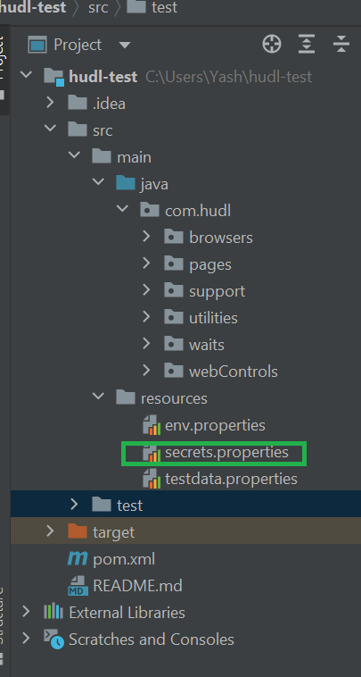
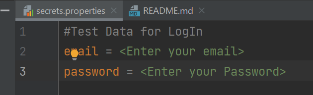
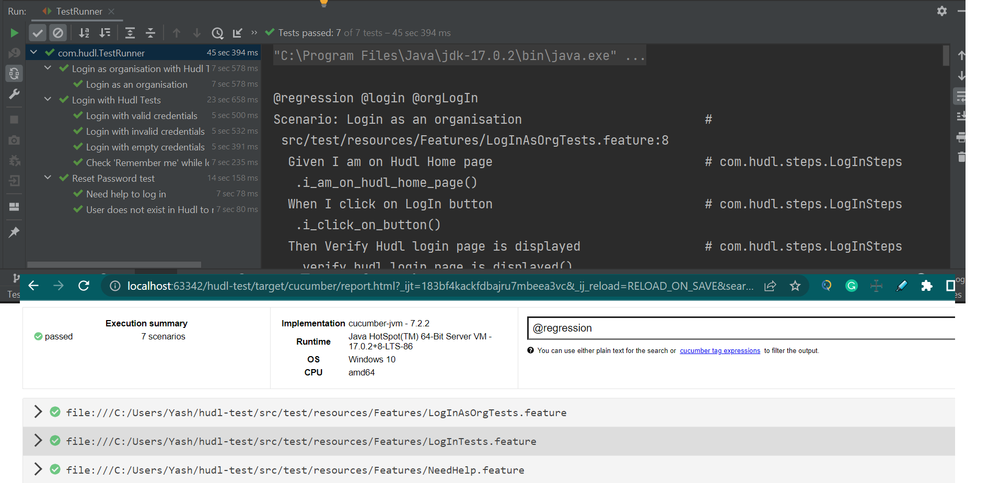

# hudl-test

Java quickstart project for test automation, covering UI tests for Hudl Sports Platform.

## Concepts Included

* Parallel test runs
* Shared state across cucumber step definitions
* Page Object pattern
* Common web page interaction methods
* Externalised test configuration
* Commonly used test utility classes
* Gherkin used to write feature files in Given, When, Then format
* Git ignore to ignore some files
* Secret file to hide the credentials

## Framework Used

* Page Object Model (POM)
* Behaviour Driven Development (BDD) framework

## Tools

* Maven
* Java
* Cucumber-JVM
* JUnit
* Selenium Webdriver
* Cucumber Reporting

## Requirements 
(*NOTE* - Pre- requisite before start running the tests)

In order to utilise this project you need to have the following installed locally:

* Maven 5 (set up Maven home in your device)
* Java 1.8 (set up Java home in your device)

  1. For Windows - Take a reference from below link to install Java and Maven, and set the path

     https://mkyong.com/maven/how-to-install-maven-in-windows/

  2. For Mac - Please a refrence from below link to install java and maven and set its path

     Java - https://mkyong.com/java/how-to-set-java_home-environment-variable-on-mac-os-x/
     Maven - https://stackoverflow.com/questions/8826881/maven-install-on-mac-os-x
  

* Selenium 4
* Create secrets file - please navigate to `src/main/resources` and create `secrets.properties` file, please take a reference from the image

Also enter your email address and password in the secrets.properties file in exact format given below for reference

## Test Coverage

#### 1. Log in tests
* With valid credentials and verify success
* With invalid credentials and verify error message
* With empty credentials and verify error message
#### 2. Login with Remember Me
#### 3. Need Help/ Reset Password tests
* With existing user and verify success
* With non-existing user and verify error message
#### 4. LogIn as Organisation tests

## Running Tests

#### 1. To run all regression test suite,
navigate to `com/hudl/TestRunner.java` file and run through tag:

`tags = "@regression"`

#### 2. To run all sanity test suite,
navigate to `com/hudl/TestRunner.java` file and run through tag:

`tags = "@sanity"`

#### 3. To run individual test suite,
navigate to `com/hudl/TestRunner.java` file and run through tag:

`tags = "@logIn"`

#### 4. To run all the test suite, run through maven, open terminal or cmd:

`mvn clean compile test`

#### 5. To run individual test , run through maven, open terminal or cmd:

`mvn test -Dcucumber.options="--tags '@negative and @validLogIn'"`

#### 6. To run all the negative tests , run through testrunner:
navigate to `com/hudl/TestRunner.java`

`tags = "@negative"`

#### 7. To run all the test suite, run through Chrome Browser (By default):

`tags = "@logIn"`

#### 8. To run all the test suite, run through Firefox Browser:
navigate to `src/main/resources/env.properties` file and change browser name

`browser = firefox`

and navigate to `com/kiinsurance/TestRunner.java` file and run through tag:

`tags = "@regression"`

## Reporting

Reports for each module are written into their respective `/target` directories after a successful run.

Hudl tests result in a HTML report for each feature in `hudl-test/target/cucumber/`.
In the case of test failures, a screenshot of the UI at the point of failure is embedded into the report.

Taken Screenshot of the tests passed when running from my local machine

*NOTE*:
As mentioned, cucumber reports are written to a separate file for each feature. This occurs as a result of running tests in parallel, meaning that you do not get a single unified test report.
If using CI, these individual reports can be joined using plugins such as the Jenkins Cucumber-JVM-Reports plugin.

## Contributor

Swati Dewangan